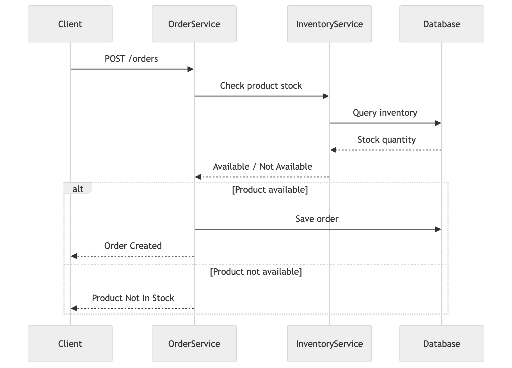
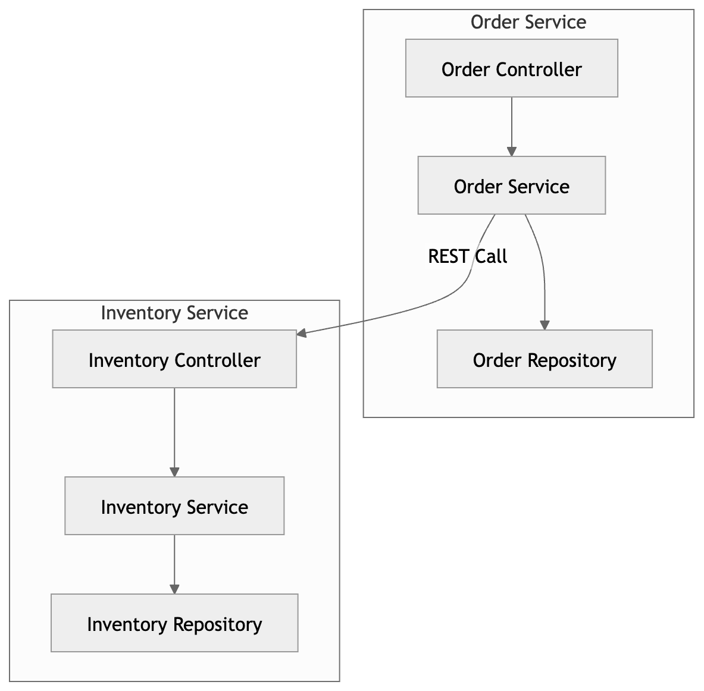

# Order Fulfillment Microservices System


A distributed backend system built using **Java and Spring Boot microservices** to simulate a real-world **order processing and inventory management workflow**.

The system consists of two independent microservices that communicate via **REST APIs** to validate inventory availability before processing customer orders.

---

## Table of Contents

* [Project Overview](#project-overview)
* [System Componenets](#system-components) 
* [System Architecture](#system-architecture)
* [Order Processing Workflow](#order-processing-workflow)
* [Service Component Architecture](#service-component-architecture)
* [Tech Stack](#tech-stack)
* [Microservices](#microservices)
* [Running the Project](#running-the-project)
* [Example Workflow](#example-workflow)
* [Future Improvements](#future-improvements)
* [Author](#author)

---

# Project Overview

This project demonstrates a **microservices-based backend architecture** where services communicate through REST APIs to complete business operations.

The system includes:

**Order Service**
Handles customer order creation and communicates with the inventory service to validate stock availability.

**Inventory Service**
Maintains product inventory and responds to stock availability checks.

When a client places an order, the **Order Service first checks the Inventory Service**. If the product is available, the order is created; otherwise an error response is returned.

---

## System Components

The system contains two independent services:

| Service | Port | Responsibility |
|------|------|------|
| Order Service | 8080 | Handles order creation and validation |
| Inventory Service | 8081 | Manages product inventory and stock validation |

Both services communicate via REST APIs.

---

# System Architecture


The architecture follows a **microservices design pattern** where services are independently deployed and communicate using HTTP REST APIs.

Flow:

Client → Order Service → Inventory Service → Database

---

# Order Processing Workflow



Order processing sequence:

1. Client sends an order request.
2. Order Service receives the request.
3. Order Service calls Inventory Service.
4. Inventory Service verifies product stock.
5. Order Service creates the order if stock is available.
6. If stock is unavailable, an error response is returned.

---

# Service Component Architecture



Each microservice follows a layered architecture:

Controller → Service → Repository → Database

This layered design improves:

* Maintainability
* Separation of concerns
* Testability
* Scalability

---

# Tech Stack

| Category        | Technology      |
| --------------- | --------------- |
| Language        | Java            |
| Framework       | Spring Boot     |
| Persistence     | Spring Data JPA |
| APIs            | REST            |
| Build Tool      | Maven           |
| Database        | H2              |
| Architecture    | Microservices   |
| Version Control | Git             |

---

# Microservices

## Order Service

Responsible for processing customer orders.

Endpoints:

POST /orders
GET /orders

Example request:

```json
{
  "productId": "P100",
  "quantity": 2
}
```

Before creating the order, the service calls the **Inventory Service** to check stock availability.

---

## Inventory Service

Responsible for managing product inventory.

Endpoints:

POST /inventory
GET /inventory/check

Example request:

```json
{
  "productId": "P100",
  "quantity": 10
}
```

---

# Running the Project

Start **Inventory Service**:

```
cd inventory-service
mvn spring-boot:run
```

Start **Order Service**:

```
cd order-service
mvn spring-boot:run
```

Services will run on:

```
Order Service     http://localhost:8080
Inventory Service http://localhost:8081
```

---

# Example Workflow

1. Add inventory through the **Inventory Service**.
2. Send an order request to the **Order Service**.
3. Order Service calls Inventory Service to verify stock.
4. If stock exists → order is created.
5. If stock does not exist → error returned.

---

# Future Improvements

Possible enhancements for production-level architecture:

* Docker containerization
* PostgreSQL database integration
* Service discovery using Eureka
* API Gateway implementation
* AWS deployment
* Centralized logging and monitoring

---

# Author

Mohammed Aslam
GitHub: https://github.com/maslam2151
